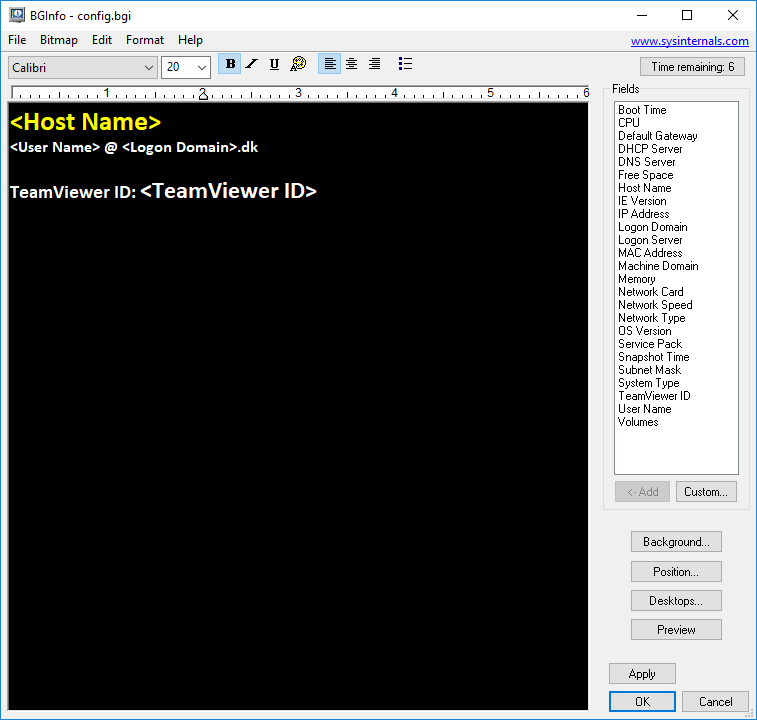

# :fleur_de_lis: bginfo_teamviewer_id

## Show your Teamviewer ID on the desktop with BgInfo.


Download BgInfo: https://docs.microsoft.com/en-us/sysinternals/downloads/bginfo

-----------------------------------------------------------------------------------------------------------------

PowerShell command: *(Run as Administrator)*
```powershell
(Get-ItemProperty -Path 'HKLM:\SOFTWARE\Wow6432Node\TeamViewer').ClientID | Out-File -FilePath c:\teamviewerid.txt
```

Fetches the TeamViewer ID from registry and saves it into a .txt file.

-----------------------------------------------------------------------------------------------------------------

Navigate to "*shell:startup*".


Create a new shortcut and add the following:
```
C:\Users\***\bin\Bginfo64.exe config.bgi /timer:0 /nolicprompt /silent /taskbar
```
BgInfo will now run on startup.

-----------------------------------------------------------------------------------------------------------------

Adding a Custom Field:


End result:


